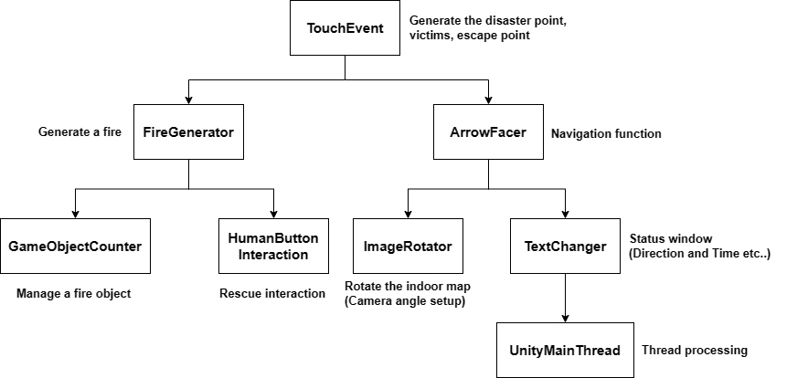
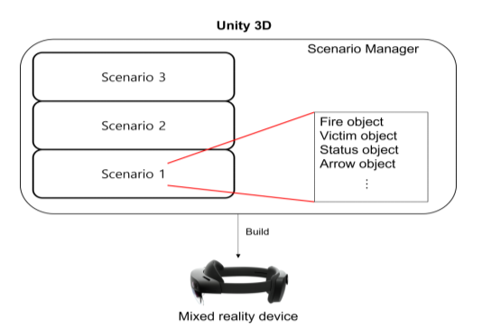

# Design of a Mixed Reality System for Simulating Indoor Disaster Rescue
## Introduction
* 실내 재난 증가 시 구조대의 구조 활동의 중요성이 더욱 커지고 있다.   
* 복잡한 환경 속에서 다양한 작업을 수행해야 하기 때문에 이는 구조 대원의 피로도를 증가시킬 수 있습니다.   
* 이를 극복하려면 다양한 환경 변수를 경험해서 숙련도를 늘리는 부분이라고 생각한다.   
* 이때, 혼합현실 기술을 통해 실내 재난에 대해 시뮬레이션을 진행해서 간접적으로 경험을 한다면 원할하고 신속한 구조 활동이 될 것으로 보인다.   
* 증강 실내 지도와 탈출 지점으로의 내비게이션 및 조난자의 위치까지의 내비게이션 등 실내 재난 구조 작업에 도움을 줄 수 있는 혼합현실 기반의 시뮬레이션 시스템을 설계하였다.   
## Methods
### System Overview
</img>

### System flow
</img>

### System functions
</img>

### Indoor Map UI
</img>

### Status UI
</img>

### Victims Generate
</img>

### Fire Generate
</img>

### System Manager
</img>

## Environment

